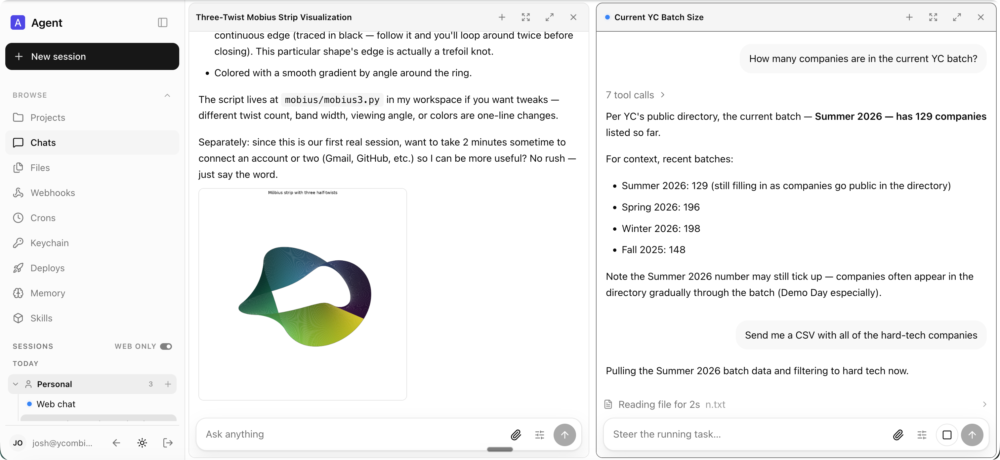
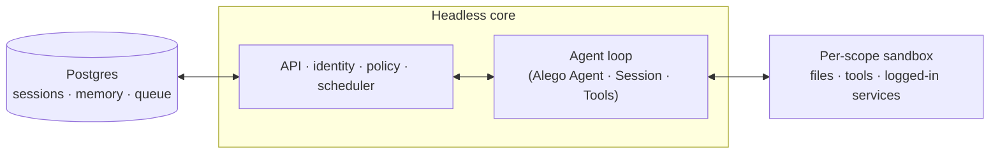

# Alego QM

QM's multiplayer workspace, Slack, policy, memory, and background-work runtime, powered by Alego agents.



## Setup

Install the bundle into an Alego profile, then start that profile:

```bash
alego plugin --profile qm add 'github:Alego-hub/alego-qm#path:alego-plugin'
alego --profile qm
```

The plugin serves the QM web app and API on `http://127.0.0.1:8080`, stores local files under
`./data/qm` unless `dataDir` is configured, and routes every QM turn through an ephemeral Alego
Agent reconstructed from QM's transcript store. Keep the Alego process running and open that URL
in a browser.
Pin the GitHub dependency to a reviewed commit for a reproducible installation.

The bundle row can be replaced in the profile's `cordis.patch.yml` to choose another Alego
provider or model and to pass QM deployment settings:

```yaml
- id: alego-qm
  config:
    provider: deepseek-official
    model: deepseek-v4-flash
    host: 127.0.0.1
    port: 8080
    dataDir: /absolute/path/to/qm-data
    env:
      DATABASE_URL: postgresql://localhost/qm
      SESSION_STORE: postgres
      RUN_STORE: postgres
      CONNECTOR_SECRET_KEY: replace-with-a-distinct-secret
```

Configuration also supports `maxTokens`, `orgId`, `backgroundWork`,
`allowUnauthenticatedCore`, and `coreSigningSecret`. The `env` map accepts the existing QM
settings documented in [`.env.example`](./.env.example). Unsigned HTTP ingress is allowed by
default only on a loopback host. A non-loopback web listener requires a signing secret plus a
separately deployed QM Portal/Auth surface that supplies signed portal identity; this Alego bundle
does not launch those services. Local loopback profiles retain browser sign-in when a signing
secret protects core traffic.
Without the Postgres settings shown above, sessions and background-work state are development-only
in-memory stores and do not survive a profile restart.

The bundle supports published Alego 0.1.2 and the 0.1.3-alpha.1 runtime. Contributors with
an Alego source checkout can verify the packed bundle through Alego's built CLI, Loader,
profile, and process lifecycle. First run `pnpm install` and `pnpm run build` in the Alego
checkout, then run these commands in this repository:

```bash
npm ci --prefix plugins/web-ui
npm run build:alego-plugin
ALEGO_SOURCE_DIR=/path/to/alego npm run test:alego-source
```

This test installs the packed plugin into an isolated profile, signs in through the web API,
executes a memory tool, replays the transcript on a follow-up turn, checks streamed output,
cancels a running turn, and verifies graceful shutdown. Its deterministic LLM provider needs
no API key. CI runs it against a pinned Alego source revision.

When running this bundle from an Alego source checkout, launch
`node apps/cli/lib/bin.js --profile qm`. A packed plugin requires the built runtime:
the source launcher can mix source and built module identities through its TypeScript aliases.

## What is QM?

Most agents are designed like personal assistants. You can make one work for a whole
company, but it quickly gets complex. QM is designed for startups. Employees each get
their own isolated workspace and work independently without affecting each other, and
they can also collaborate with the agent in channels, group messages, and projects.

Each person and each room has its own scoped memory, files, keychain view, permissions,
crons, web apps, and durable sandbox.

It's built with open source in mind. Alego owns model routing and the agent loop while QM
provides the durable, multiplayer application around it, so model and provider selection stay
in the Alego composition instead of being tied to one vendor.

## Features

- **Personal and shared scopes.** People customize the agent to be _theirs_, and still
  work with it collaboratively in Slack channels and projects.
- **Slack and web.** The same identity and configuration carries between Slack and the
  web app.
- **Admin control.** Set org-level configuration, a security posture, and which
  harnesses and models are available.
- **Web apps.** Spin up custom internal apps and publish them to the right people.
- **Shared skills.** Skills are scope-owned and shareable by grant, with admin-gated
  promotion to the whole org and skill packs imported from git repositories.
- **Background work.** Crons, watches, and inbound webhooks run work while nobody's
  watching.

## What you can do with it

- Search internal notes, email, documents, databases, and the web together
- Retrieve information from your company brain
- Build internal apps, publish them to the right people, and keep their data current
- Learn your writing voice from past sends, then triage your inbox on a schedule —
  labels and reply drafts included
- Work in an existing repository: run tests, open PRs, monitor CI, check system logs
- Track a project in a shared channel and post updates and follow-ups

## Architecture



Every turn in this bundle runs through an Alego Agent, while QM's adapter preserves the
core's harness boundary. A Postgres persistence layer holds user data, session history,
and other durable state. The agent has a small, fixed tool surface; one of those tools is
`execute`, which runs commands in the scope's own isolated sandbox — its durable computer,
where installed tools stay installed. The web UI, the admin panel, and the public portal
are optional plugins over the core's HTTP API;
Slack is an optional in-process plugin that core starts
and supervises through a direct service client.

The core runs TypeScript directly on Node and uses Fastify for HTTP. The Slack plugin
uses Bolt; the web UI builds with Vite and renders with Lit.

The core itself is generic. Everything specific to one company — org config, custom tools
and skills, sandbox image, infrastructure — lives in a **deployment directory** that the
[`qm` CLI](./cli/README.md) validates and deploys. Every substrate (harness, session
store, sandbox, memory) sits behind an interface, so production implementations swap in
via one wiring file.

## Security and secrets

QM's approach follows local coding agents like OpenCode, Codex, and Claude Code: the
agent acts as the person it's working for, with their credentials and permissions, and
everything it does is audited. An org picks one security posture, which narrower scopes
can only tighten:

- **Strict** — every harness tool call pauses for human approval, except the two
  no-effect turn enders.
- **Auto** (default) — a classifier screens provenance-labelled external data and tool
  results before they reach the model; a deployment can point that at its own screening
  proxy.
- **Dangerous** — no content screening, no pauses between tool calls.

The predeclared command policy — approval rules and hard denials for things like
recursive deletes or destructive SQL — applies in every posture, Dangerous included.

[`SECURITY.md`](./SECURITY.md) has the threat model, the operator assumptions, and the
known limitations.

## Deploy it for your org

Create an organization-owned deployment repository that depends on `@yc-software/qm`:

```bash
npm exec --yes --package=@yc-software/qm@latest -- \
  qm init . --org <slug> --target <fly-or-aws>
npm install
```

Initialization materializes a deployment skill for an agent and walks through
infrastructure, web sign-in, connector credentials, optional Slack access, deployment,
and live verification — no source checkout required. Each deployment runs in the
operator's own cloud account; initialization does not generate or enable deployment CI,
and this repository has no production deployment workflow. See
[`deployment.md`](./deployment.md) for the details.

## Contributing

We take contributions as _human-written_ text, not code — see
[`CONTRIBUTING.md`](./CONTRIBUTING.md). Describe the change you'd like informally in a
`.txt` or `.md` file in [`adrs/`](./adrs/), and if we're aligned we'll handle the
implementation. Report vulnerabilities privately — see [`SECURITY.md`](./SECURITY.md),
not a public issue.

## Customize your instance

The deployment repository above carries config and a sandbox layer, and never needs a
source checkout. Some organizations want the opposite trade: the whole codebase in one
place, so engineers and coding agents read core and customizations together, while the
customizations themselves stay private. For that, keep a **private fork**: a standalone
private repository whose history begins as a clone of qm and whose core stays identical
to upstream.

Populate it once, then clone it to work in:

```bash
gh repo create <org>/qm-private --private

git clone --bare git@github.com:yc-software/qm qm-seed.git
git -C qm-seed.git push --mirror git@github.com:<org>/qm-private
rm -rf qm-seed.git

git clone git@github.com:<org>/qm-private
git -C qm-private remote add upstream git@github.com:yc-software/qm
```

Create the private fork with a plain clone, as shown above, and never with GitHub's fork
feature. The word "fork" here names the concept — a downstream copy that diverges
deliberately and merges from upstream — not GitHub's Fork button. A GitHub fork inherits
the visibility of the repository it came from, so a fork of a public repository cannot be
made private. A GitHub fork also shares one object network with the repository it came
from, so commits pushed to the fork stay fetchable by SHA from the public side. Many
organizations disallow forking private repositories as well. A plain clone has none of
these problems, and it costs one thing: the clone is an ordinary repository, so upstream's
CI workflows run live in your own account. Expect to supply the secrets those workflows
need, or disable the ones you do not want running.

Everything specific to your organization goes in `deploy/layers/<org>/` — config, sandbox
tools and skills, plugin images, infrastructure — in the same shape `qm init` produces. See
[`deploy/layers/README.md`](./deploy/layers/README.md). Core stays byte-identical to
upstream, which is what keeps merges small.

Two skills maintain the boundary in both directions. `update-qm` merges upstream qm into
the private fork and opens the sync PR; `upstream-pr` sends an organization-agnostic fix back to
qm, cutting the branch from `upstream/main` and checking the outgoing diff, commit
messages, and screenshots for organization identifiers before it pushes. Nothing under
`deploy/layers/` ever travels upstream.

## Going deeper

- [`docs/getting-started.md`](./docs/getting-started.md) — first run, end to end
- [`cli/README.md`](./cli/README.md) — the `qm` CLI and the deployment directory contract
- [`docs/deploy-directory.md`](./docs/deploy-directory.md) — the deployment directory in full
- [`.env.example`](./.env.example) — every knob, documented in place
- [`plugins/`](./plugins) — the surfaces (Slack, web UI, admin, portal)

## License

Except where otherwise noted, QM is available under the [MIT License](./LICENSE).
